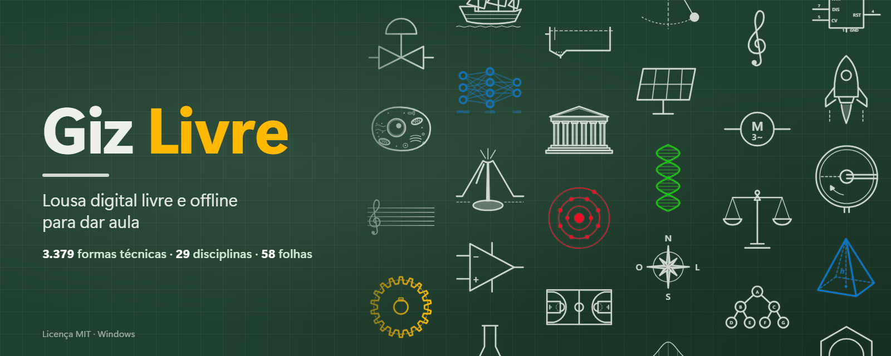
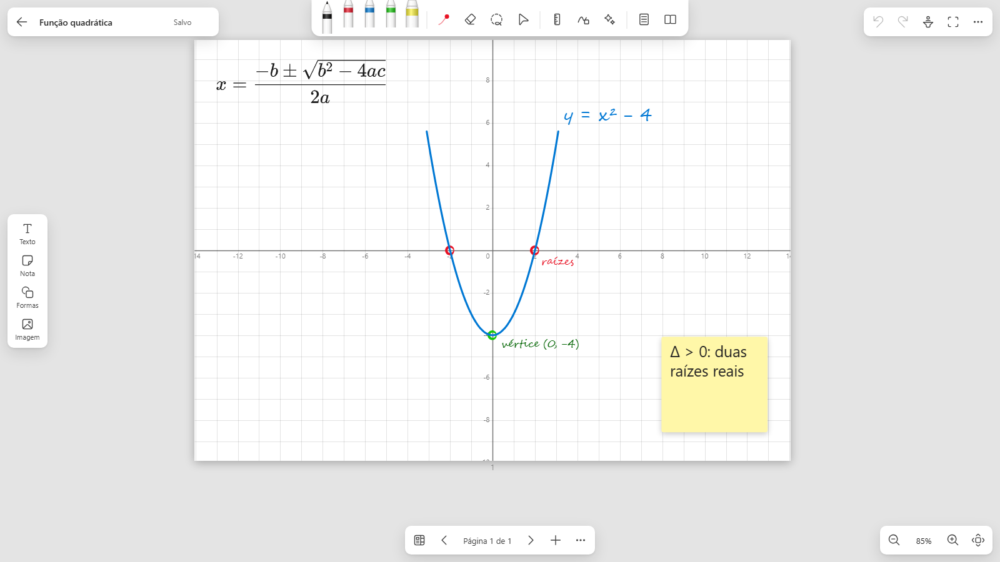
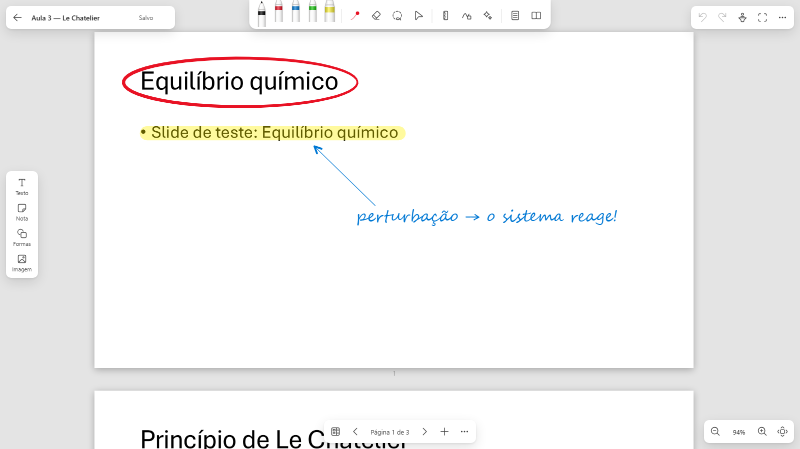
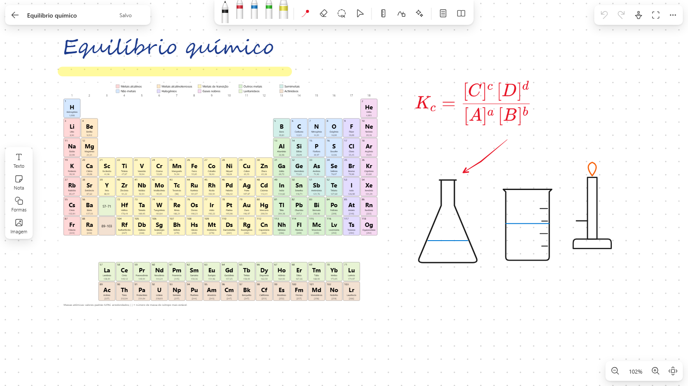
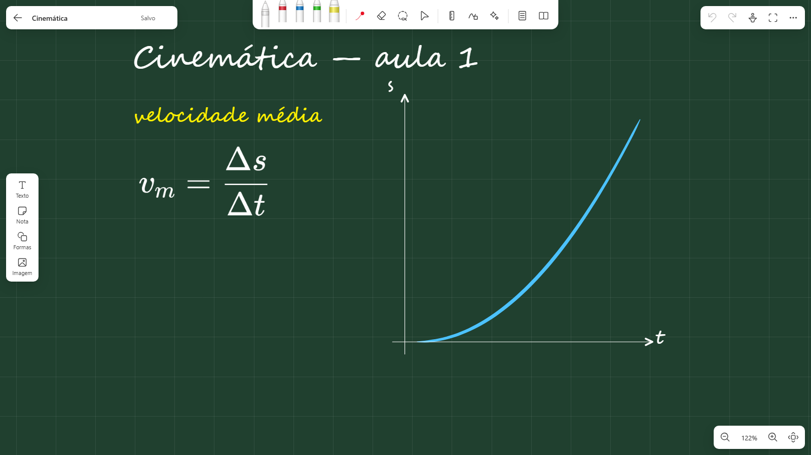

<p align="center"></p>

# Giz Livre

**Lousa digital livre e offline para dar aula com mesa digitalizadora, caneta, toque ou mouse.**
Nasceu como substituta do Microsoft Whiteboard para Windows (descontinuado em outubro de 2026) e foi além: caderno A4,
slides do PowerPoint com escrita por cima, folhas quadriculadas e milimetradas, fórmulas e ferramentas de professor.

<p align="center">
  <a href="https://github.com/HeraldoAntunes/giz-livre/releases/latest"><b>⬇ Baixar o Giz Livre para Windows</b></a>
  &nbsp;·&nbsp; <a href="docs/GUIA-DE-USO.md">Guia de uso</a>
  &nbsp;·&nbsp; <a href="#linux-e-macos-experimental">Linux e macOS</a>
  &nbsp;·&nbsp; <a href="#perguntas-frequentes">Perguntas frequentes</a>
</p>

- **Grátis e livre:** licença [MIT](LICENSE). Use, copie e distribua à vontade, inclusive em escolas e redes de ensino.
- **Sem internet, sem conta, sem anúncios:** os quadros ficam só no seu computador.
- **Versão:** 1.0.1 ([novidades](CHANGELOG.md))

> **Aviso:** projeto independente e voluntário, fornecido "no estado em que se encontra", **sem garantia de qualquer
> tipo**. Faça backup dos seus quadros. Não há vínculo com a Microsoft, a Wacom nem outras marcas citadas.

## Como baixar e instalar (Windows)
1. Abra a página de **[downloads (Releases)](https://github.com/HeraldoAntunes/giz-livre/releases/latest)**.
2. Baixe o arquivo que serve para você:

   | Arquivo | Para quem |
   |---|---|
   | **`Instalar-GizLivre-x.y.z.exe`** ⭐ | **quase todo mundo.** Dois cliques e "Avançar": cria os atalhos e não pede senha de administrador |
   | `GizLivre-x.y.z-portatil.zip` | quem quer levar num pendrive sem instalar: descompacte e abra `GizLivre.exe` |
   | Código-fonte | só para quem vai estudar ou modificar o programa |

3. Abra pelo atalho **Giz Livre** na Área de Trabalho ou no Menu Iniciar.

O Windows pode avisar "editor desconhecido" (SmartScreen), porque o programa não tem assinatura digital paga. Clique em
*Mais informações → Executar assim mesmo*. Para conferir se o arquivo é legítimo, compare o SHA-256 com o
`SHA256SUMS.txt` da mesma página:
```bash
certutil -hashfile Instalar-GizLivre-1.1.0.exe SHA256
```

## Como é
| Caderno A4 com plano cartesiano | Slides do PowerPoint anotados |
|---|---|
|  |  |
| **Química: tabela periódica, vidrarias e fórmula** | **Lousa verde com tinta branca** |
|  |  |

## Recursos
- **Escrever:**
  - 4 canetas com pressão, estilos tinteiro, caligrafia e pincel;
  - marca-texto, ponteiro laser, borracha (de traço inteiro ou só onde passar);
  - formas (linha, seta simples, dupla e tracejada, retângulo, elipse, triângulo), texto, notas adesivas e imagens;
  - **limpar a lousa** de uma vez (dá para desfazer).
- **Mesa digitalizadora** (Wacom, XP-Pen, Huion, Gaomon, telas com caneta):
  - pressão, botão lateral e ponta-borracha;
  - **estabilizador contra tremido**;
  - painel de teste.
- **Escrita mais bonita:**
  - **embelezar escrita** (endireita a linha e iguala altura e espaço, sem trocar a sua letra);
  - **escrita à mão → texto** em fonte cursiva (no Windows, offline).
- **Folhas:** quadriculada, milimetrada, pontilhada, pautada, caderno, caligrafia, isométrica, hexagonal, plano
  cartesiano, polar, pauta musical e Cornell, com fundo branco, creme, verde-lousa ou preto.
- **Caderno A4** (e A3, 16:9): páginas prontas para **imprimir e exportar PDF**.
- **Slides:** abra um **PowerPoint** ou **PDF**; cada slide vira uma página para escrever por cima. O **modo
  apresentação** passa os slides com as setas ou com o passador.
- **Ferramentas de professor:**
  - **plotar função** (digite `x^2 - 4` e o gráfico aparece no plano cartesiano);
  - lupa de escrita (escreve grande, cai pequeno), transferidor, compasso, cortina, holofote, cronômetro;
  - **fórmulas LaTeX**;
  - biblioteca com **tabela periódica** e **vidrarias**.
- **Biblioteca de formas técnicas**, com **1.384 formas** em 12 disciplinas, separadas em seções e com busca:
  - fluxograma;
  - setas e conectores;
  - química e processos (P&ID, estruturas, cinética, eletroquímica);
  - hidráulica;
  - saneamento (ETA e ETE, com jarteste, UASB, lodo ativado e lagoas);
  - laboratório (vidrarias, equipamentos e pictogramas de segurança);
  - elétrica (inclusive NBR 5444);
  - eletrônica (com portas lógicas);
  - sistemas embarcados (placas de prototipagem, sensores e módulos);
  - energias renováveis;
  - estatística e gráficos;
  - ícones gerais para aula.

  Cada forma entra na cor escolhida, pode ser recolorida, movida e redimensionada, e a borracha a apaga.
- **Barras móveis:** o cadeado destrava as barras para arrastar cada uma até onde preferir.
- **Organização:** galeria com miniaturas, busca, salvamento automático, desfazer/refazer, exportar PNG/PDF/`.lousa`
  e importar imagens do Microsoft Whiteboard.

## Sistemas
| | Windows 10/11 | Linux (experimental) | macOS (experimental) |
|---|---|---|---|
| Instalador e atalhos | ✅ | — (rodar pelo código) | — (rodar pelo código) |
| Quadro, canetas, folhas, caderno, PDF, apresentação, ferramentas | ✅ | ✅ testado no Ubuntu | ⚠️ não testado |
| Pressão da caneta | ✅ (Windows Ink) | ✅ geralmente, no Chrome/Chromium | ⚠️ depende do driver |
| Abrir PowerPoint (`.pptx`) | ✅ PowerPoint ou LibreOffice | ✅ com LibreOffice | ⚠️ com LibreOffice |
| Abrir PDF | ✅ | ✅ | ✅ |
| Escrita à mão → texto | ✅ | ❌ (usa o reconhecedor do Windows) | ❌ |

É preciso ter o **Microsoft Edge** ou o **Google Chrome/Chromium** instalado; o programa abre numa janela própria deles.

### Linux e macOS (experimental)
Precisa de **Python 3.10+** e do Chrome/Chromium/Edge. Para abrir PowerPoint, instale o **LibreOffice**, que é gratuito.
```bash
git clone https://github.com/HeraldoAntunes/giz-livre.git
```
```bash
cd giz-livre && ./giz-livre.sh
```
Os quadros ficam na pasta `quadros`, dentro da pasta do programa. Encontrou algum problema? Abra uma
[issue](https://github.com/HeraldoAntunes/giz-livre/issues) contando o sistema e a mesa que você usa.

## Atalhos de teclado
| Tecla | Ação | Tecla | Ação |
|---|---|---|---|
| `1`–`4` / `P` | canetas | `E` | borracha |
| `H` | marca-texto | `L` / `V` | laço / selecionar |
| `K` | laser | `R` | régua |
| `T` | texto | `[` `]` | espessura |
| `Ctrl+Z` / `Ctrl+Y` | desfazer / refazer | `Espaço` + arrastar | mover o quadro |
| `Ctrl+0` | ajustar à tela | `Tab` | modo aula (esconde as barras) |
| `PageUp`/`PageDown` | página anterior/próxima | `F11` | tela cheia |

No macOS, use `Cmd` no lugar de `Ctrl`. Os atalhos podem ser associados às teclas da mesa digitalizadora (ExpressKeys) no
driver dela.

## Perguntas frequentes
**É de graça mesmo?** Sim. É software livre (licença MIT): pode usar, copiar, instalar em quantos computadores quiser e
distribuir.

**Precisa de internet?** Não. Tudo funciona offline, e o programa não envia nada para fora do computador.

**Onde ficam os meus quadros?** Na versão instalada, em `Documentos\Giz Livre\quadros`. Na portátil e no Linux/macOS,
na pasta `quadros` ao lado do programa. Para fazer backup, copie essa pasta.

**Funciona com a minha mesa digitalizadora?** Se ela funciona no Windows com o **Windows Ink** ligado no driver, funciona
no Giz Livre. Veja o passo a passo no [Guia de uso](docs/GUIA-DE-USO.md#2-primeira-vez-com-mesa-digitalizadora-5-minutos).

**Consigo usar os quadros do Microsoft Whiteboard?** Exporte cada quadro como imagem no Whiteboard e use **Importar** na
galeria do Giz Livre: cada imagem vira um quadro em que dá para continuar escrevendo.

**O antivírus reclamou. É seguro?** O executável passa pelo Microsoft Defender antes de cada publicação, e você pode
conferir o SHA-256. Alertas de "editor desconhecido" acontecem porque não há assinatura digital paga. Veja
[SECURITY.md](SECURITY.md).

**Posso usar na minha escola ou rede de ensino?** Pode, à vontade, mantendo o aviso de licença.

**Encontrei um erro ou tenho uma ideia.** Abra uma [issue](https://github.com/HeraldoAntunes/giz-livre/issues/new/choose).

## Tecnologias
- **Interface:** HTML, CSS e JavaScript puro (módulos ES), desenhada em `<canvas>`, sem build e sem frameworks.
- **Servidor local:** Python, só biblioteca padrão, em `127.0.0.1`, com proteção contra pedidos de outros sites.
- **Bibliotecas embutidas:** pdf.js (Mozilla, Apache 2.0, com OpenJPEG), KaTeX (MIT, fontes sob SIL OFL 1.1),
  Fluent UI System Icons (Microsoft, MIT). Ver
  [THIRD-PARTY-NOTICES.md](THIRD-PARTY-NOTICES.md).
- **Recursos do sistema (opcionais):**
  - Windows Ink (caneta e reconhecimento de escrita);
  - PowerPoint (COM) ou LibreOffice para `.pptx`.
- **Empacotamento:** PyInstaller e Inno Setup.

Para entender o código, veja [docs/ARQUITETURA.md](docs/ARQUITETURA.md).

## Contribuir
Sugestões e correções são bem-vindas. Veja [CONTRIBUTING.md](CONTRIBUTING.md) e a política de segurança em
[SECURITY.md](SECURITY.md).

## Licença
[MIT](LICENSE) © 2026 Heraldo Antunes.

### Autoria das formas e ícones
Todas as formas da biblioteca (`app/js/shapes/`) e os desenhos de vidrarias e da tabela periódica (`app/js/library.js`)
foram **desenhados para o Giz Livre**, como código SVG escrito no próprio projeto. Elas estão sob a mesma licença MIT do
programa e podem ser usadas, modificadas e redistribuídas livremente.

Nenhum desenho foi copiado de outras bibliotecas: nem do draw.io, nem do Visio, nem de pacotes de ícones ou da Wikimedia.
Os símbolos técnicos seguem apenas as **convenções** das normas: ISO 5807 (fluxograma), ISA 5.1 e ISO 10628 (P&ID),
IEC 60617 e ABNT NBR 5444 (elétrica), IEEE 91 (portas lógicas) e o GHS (pictogramas de segurança). As convenções
descrevem como o símbolo deve ser; o desenho de cada forma é original.

As placas de prototipagem aparecem como desenhos esquemáticos genéricos, só com o nome em texto e **sem logotipos**.
Arduino, ESP32, Raspberry Pi e STM32 são marcas dos respectivos donos e aparecem apenas para identificar o tipo de placa.
Os únicos ícones de terceiros são os da interface (Fluent UI System Icons, MIT), listados em
[THIRD-PARTY-NOTICES.md](THIRD-PARTY-NOTICES.md).
